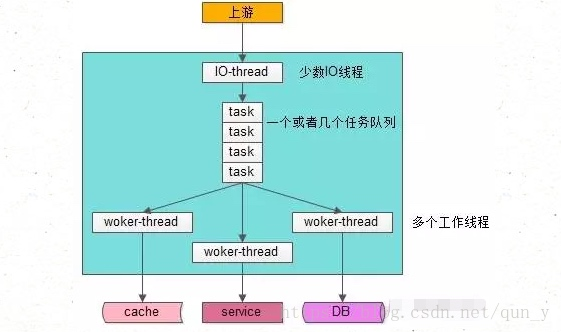
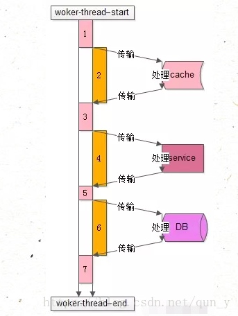

## 需求

我们在创建线程池的时候线程池的数量不是盲目设置的，那问题是到底设置为多少能够最大化CPU性能
## 常见问题
#### 工作线程数为什么不是越大越好
一来服务器CPU核数有限，同时并发的线程数是有限的，1核CPU设置1000个工作线程是没有意义的
线程切换是有开销的，如果切换过于频繁，反而会降低性能
####如果CPU是单核，设置多线程有意义么，能提高并发性能么
单核CPU不一定不可以使用多线程，关键问题在于单核CPU在执行任务代码过程中CPU占用率是否是100%，下面会介绍说明
##常见服务线程模型

* 少数IO线程监听上游发来的请求，负责接收任务
* 一个或者几个人物队列，负责IO线程核Worker线程之间的数据传输通道
* 有多个工作线程执行真正的任务
##工作线程的工作模式

* 上图过程共7步
* 1.从工作队列里拿出任务，执行本地初始化计算，如http协议分析、参数解析、参数校验
* 2.访问cache
* 3.计算cache中拿到的数据
* 4.调用RPC获取下游service的数据，或下游service处理相关任务
* 5.执行service之后，对数据进一步处理
* 6.访问数据库
* 7.收尾

分析整个过程，发现：
* 1. 1,3,5,7中需要占用本地CPU
* 2. 2，4，6中不需要本地CPU
##合理设置线程数
####单核CPU
上述例子中2，4，6不需要本地CPU，也就是这部分时间，CPU可以执行其它的任务，假设1，3，5，7所需时间为x，2，4，6所需时间为y，则CPU的利用率为x/(x+y),单位时间CPU所能处理的线程任务数为(1/(x/(x+y))).
####N核CPU
N核单位时间最大处理能力(CPU跑到100%)为N*单核即 N*(x+y)/x

